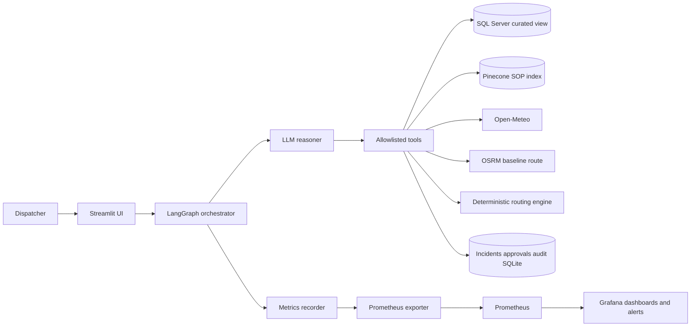
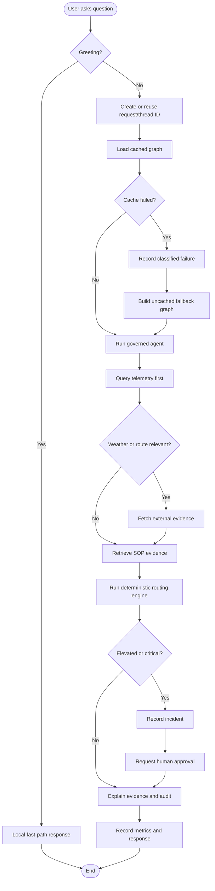
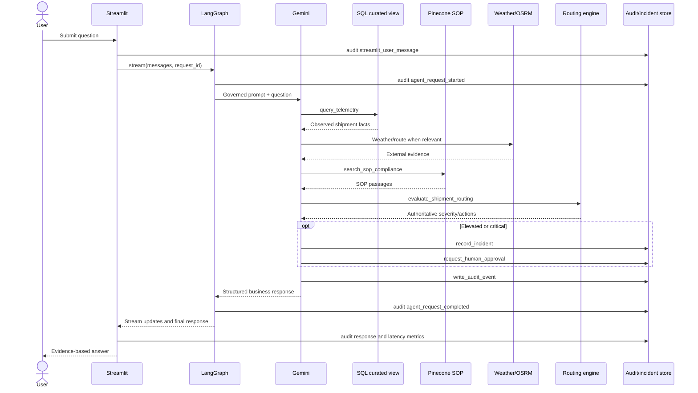

# Governed Logistics Supply-Chain AI Assistant

An evidence-first logistics assistant for cold-chain compliance, shipment
telemetry, weather and route risk, deterministic operational decisions,
incident management, human approvals, audit logging, and SRE observability.

This repository is a learning and local-development implementation. It is not
approved for real customer, employee, medical, payment, or production
shipment data without a formal security and operational review.

## Capabilities

- Read-only shipment telemetry through a curated SQL Server view.
- SOP retrieval from Pinecone using local
  `sentence-transformers/all-MiniLM-L6-v2` embeddings.
- Open-Meteo weather observations and hourly forecast data.
- OSRM/OpenStreetMap baseline routes; this is not live traffic.
- Deterministic routing rules for temperature, exposure, reefer power,
  congestion, weather, road closure, depot capacity, and delay risk.
- Governed incident recording and human-approval requests.
- Sanitized request, tool, incident, and approval audit events.
- Streamlit multi-user UI with per-browser thread IDs.
- Process-local model/vector/SQL caching with fallback graph loading.
- Prometheus exporter, Grafana dashboard, and provisioned alert rules.
- Unit tests and opt-in live integration tests.

## Architecture overview



The LLM chooses tools and explains evidence. It does not own operational
thresholds. `scripts/routing_engine.py` is authoritative for deterministic
severity, reasons, actions, escalation owners, and update intervals.

## High-level design (HLD)

### Components

| Layer | Component | Responsibility |
|---|---|---|
| Presentation | Streamlit | Chat, session/thread state, safe traces, audit view |
| Orchestration | LangGraph/LangChain | Checkpointed request and tool loop |
| Reasoning | Gemini or optional OpenAI | Evidence-based explanation and tool selection |
| Evidence | SQL Server | Observed telemetry through `FDE_VIEWS.VW_ACTIVE_FLEET` |
| Evidence | Pinecone | Approved SOP passage retrieval |
| Evidence | Open-Meteo/OSRM | External weather and baseline route observations |
| Decision | Routing engine | Deterministic policy evaluation |
| Governance | Operations store | Incidents, approvals, audit events, metrics |
| Observability | Prometheus/Grafana | Metrics, latency, quota and failure alerts |
| Delivery | GitHub Actions | Compile, test, dependency review, optional integration tests |

### Trust boundaries

```text
User input
  → authenticated application boundary
  → allowlisted tools
  → read-only telemetry / approved external providers
  → deterministic decision boundary
  → human approval boundary
  → audited response
```

The agent cannot execute rerouting, disposal, hold release, or customer
contact. It can detect a condition, record an incident, and request approval.

## Low-level design (LLD)

### Request state

`src/orchestrator.py` carries:

```text
messages      user, AI, and tool messages
request_id    correlation ID and LangGraph thread ID
shipment_id   optional shipment context
status        started or completed
```

The current local checkpointer is `InMemorySaver`. It is suitable for learning
but loses state on process restart and is not sufficient for multi-replica
production deployment.

### Tool boundaries

| Tool | Input | Output/side effect |
|---|---|---|
| `query_telemetry` | Shipment ID and limit | Read-only curated-view rows |
| `search_sop_compliance` | Policy question | Relevant SOP passages |
| `get_weather` | Latitude/longitude | Current and hourly weather |
| `get_route` | Origin/destination coordinates | Baseline OSRM route |
| `evaluate_shipment_routing` | Shipment ID | Deterministic decision |
| `record_incident` | Shipment and decision | Persists open incident |
| `get_incident_status` | Incident or shipment ID | Incident records |
| `request_human_approval` | Incident and action | Persists pending approval |
| `write_audit_event` | Sanitized event payload | Append-only audit event |
| `get_audit_events` | Request/event filter | Sanitized audit records |

### Data stores

Development uses:

```text
SQL Server Docker       telemetry
Pinecone                SOP vectors
agent_operations.sqlite incidents, approvals, audit, metrics
InMemorySaver           temporary conversation checkpoints
```

Production requires a durable shared checkpointer and durable shared
incident/audit database.

## Activity diagram



## Sequence diagram



## Local setup

Requirements:

- macOS/Linux
- Conda or Python 3.12
- Docker Desktop
- SQL Server container for telemetry
- Pinecone account/key for SOP retrieval
- Gemini key for the default reasoner

Create and activate the environment:

```bash
conda create -n fde_test python=3.12 -y
conda activate fde_test
pip install -r requirements.txt
```

Create `.env` from `.env.example` and keep all secrets local. Never commit
`.env`. Configure at least:

```env
LLM_PROVIDER=gemini
GEMINI_API_KEY=...
GEMINI_MODEL=gemini-3.6-flash
PINECONE_API_KEY=...
PINECONE_INDEX_NAME=logistics-policy
AGENT_FDE_RO_PASSWORD=...
```

Follow `docs/instructions.md` for SQL ingestion, security view setup, SOP
ingestion, Pinecone validation, and synthetic data generation.

## Run the application

Command-line request:

```bash
conda run --no-capture-output -n fde_test \
  python -m src.orchestrator \
  "Check shipment compliance for US-FC-00032065."
```

Streamlit:

```bash
conda run --no-capture-output -n fde_test \
  streamlit run src/streamlit_app.py
```

The first operational request may be slower because the graph, local
embedding model, Pinecone client, and SQL engine initialize. These resources
are cached per process. Greetings use a local fast path and do not invoke the
model. If cached graph creation fails, the UI records the failure and attempts
an uncached fallback.

## Audit and observability

Inspect the local audit log:

```bash
conda run --no-capture-output -n fde_test \
  python scripts/view_agent_log.py --limit 20
```

Metrics are stored locally and exported in Prometheus format:

```bash
conda run --no-capture-output -n fde_test \
  python ops/monitoring/metrics_exporter.py
curl http://localhost:9108/metrics
```

Metrics include request success/failure, request/model/dependency latency,
cache initialization, quota failures, incidents, approvals, and audit-write
failures. Failure categories include:

```text
recoverable_dependency_failure
invalid_configuration
missing_secret
model_quota_failure
database_permission_failure
unknown_failure
```

## Grafana and Prometheus

Grafana OSS is free to self-host. Start the local stack:

```bash
docker compose -f ops/monitoring/docker-compose.yml up -d
```

Open:

```text
Grafana:    http://localhost:3000
Prometheus: http://localhost:9090
Exporter:   http://localhost:9108/metrics
```

Grafana is configured automatically with the Prometheus data source
`http://prometheus:9090` because Grafana reaches Prometheus by Docker service
name. Your Mac browser uses `localhost` because it reaches the published host
ports.

The stack provisions alert rules for:

- p95 request latency above 10 seconds for 5 minutes
- Any model quota failure
- Any audit-write failure

Rules are under:

```text
ops/monitoring/grafana/provisioning/alerting/
```

The dashboard is:

```text
ops/monitoring/logistics-agent-dashboard.json
```

See `ops/monitoring/README.md` for dashboard import, scrape troubleshooting,
and production migration to CloudWatch, Amazon Managed Service for Prometheus,
Grafana Cloud, or OpenTelemetry.

## Testing

Run the safe unit suite:

```bash
conda run --no-capture-output -n fde_test \
  python -m unittest discover -s tests -v
```

Run live integration tests only when dependencies are intentionally available:

```bash
RUN_INTEGRATION_TESTS=1 \
conda run --no-capture-output -n fde_test \
python -m unittest discover -s tests/integration -v
```

Live tests cover SQL Server, Pinecone, weather, routing, audit persistence,
and an LLM tool-calling smoke test. The LLM test can consume provider quota.

## CI/CD

Delivery automation is separate from application code:

```text
.github/workflows/ci.yml
.github/workflows/quality.yml
```

The CI workflow compiles Python and runs unit tests on pushes and pull
requests. Live integration tests are enabled only with the repository variable
`RUN_INTEGRATION_TESTS=true`. The quality workflow runs dependency review
manually. Future deployment workflows should build and scan a container,
deploy staging, run health checks, require approval, and deploy production.

## Production roadmap

Before production use:

1. Replace `InMemorySaver` with a durable shared LangGraph checkpointer.
2. Replace local SQLite incidents/audit/metrics with approved durable stores.
3. Add SSO, RBAC, tenant boundaries, and authenticated audit access.
4. Put databases and providers behind private networking and secret managers.
5. Add forecast-aware one-hour impact logic; do not present current data as a
   guaranteed future outcome.
6. Export metrics to CloudWatch, Prometheus, Grafana Cloud, or OpenTelemetry.
7. Add notification policies for quota, latency, database, audit, incident,
   approval, and unauthorized-access alerts.
8. Deploy to staging before production and complete operational acceptance.

## Documentation map

| Document | Purpose |
|---|---|
| `docs/instructions.md` | Detailed setup, governance, phases, monitoring, and deployment notes |
| `ops/monitoring/README.md` | Local Prometheus/Grafana instructions |
| `tests/README.md` | Unit and integration test instructions |
| `src/prompts/system_prompt.txt` | Governed agent behavior and response format |
| `scripts/routing_engine.py` | Authoritative deterministic decision rules |
